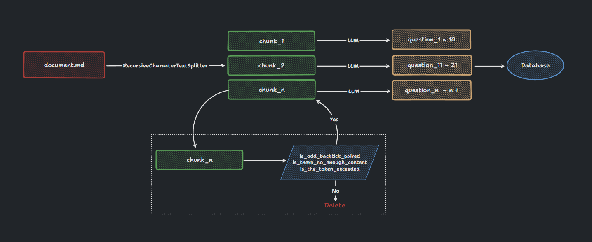

# Best Documentation Practices

## Document Upload Process

First, let's understand what happens throughout the document upload process.



1. I will initially utilize the `RecursiveCharacterTextSplitter` class from langchain to split the document into several Chunks.

2. After obtaining the Chunks, I will conduct a series of checks on them. The functions involved are `is_odd_backtick_paired`, `is_there_no_enough_content`, `is_the_token_exceeded`. These functions can be viewed in the [share.py](https://github.com/codeacme17/examor/blob/main/server/loaders/share.py) file.

3. Finally, the divided Chunks will be concatenated into the Prompt and sent to LLM to generate questions, which are then stored in the database.

## Document Format

From the above process, it's evident that there's a slicing process. This implies that **a better document format will result in better slicing results, which will in turn affect the quality of questions LLM generates**. Although I've optimized the slicing logic considerably to accommodate various formats, it's not infallible. Hence, users are advised to follow the formatting guidelines below:

### Clear Headings

By "headings" here, I don't only mean major titles like `#1`. Instead, every paragraph should have a distinct heading to guide it.

```markdown
✔️

# Hello World

some content

## How to see hello

some content
```

```markdown
❌

# Hello World

some content
How to see hello
some content
```

### Avoid Overly Long Code Blocks

We recommend not having excessively long and uncommented code blocks (exceeding 2500 tokens) in the document. Chunks containing only code without content descriptions might lead LLM to generate sub-par questions. If you deem the code in your document important, please provide comments and logically break it down.

````markdown
✔️

```js
// this is a sum function to sum a and b
function sum(a, b) {
  // ....
  // lines 2000
  // ...
}
```
````

````markdown
❌

```js
function sum(a, b) {
  // ....
  // lines 2000
  // ...
}
```
````

### Sample Document

I have prepared a [document](https://github.com/codeacme17/examor/blob/main/docs/templates/zh-vue-props.md) from the Vue repository that describes `props`. It has a very user-friendly format, and I recommend using it for reference or testing purposes.
